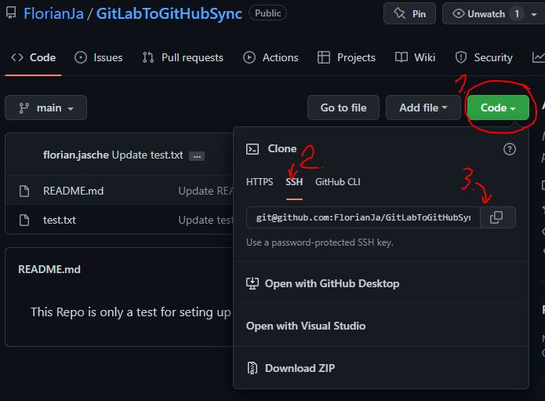
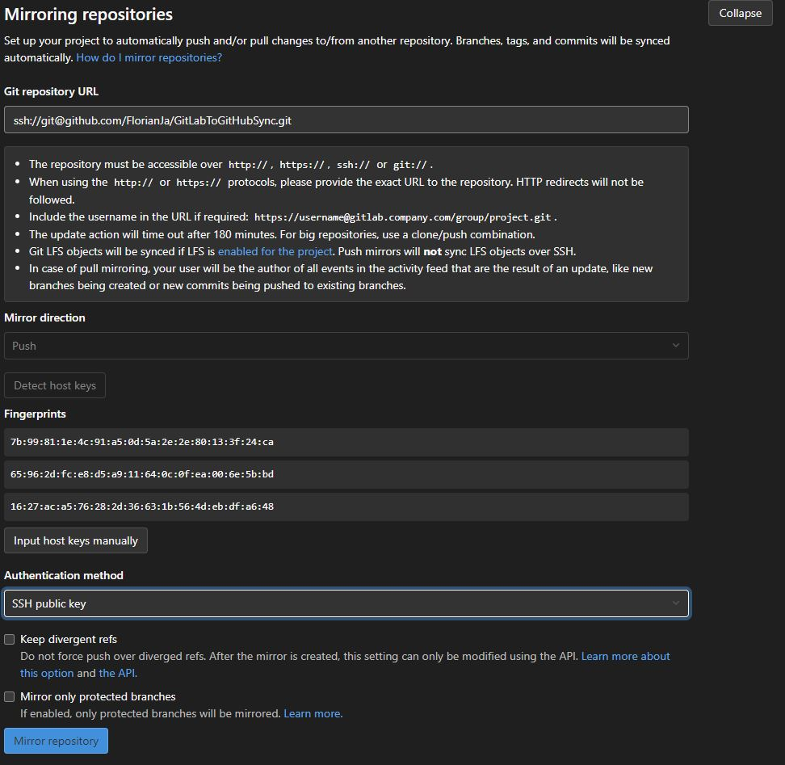
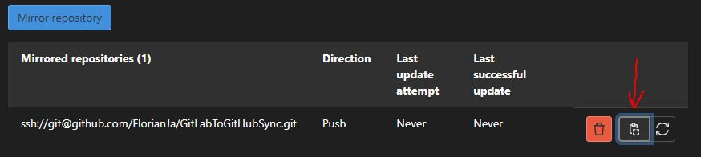

## How to clone a GitLab repo to GitHub

1. Create GitLab Repo and commit content
2. Create GitHub Repo
3. Copy SSH link of GitHub Repo 
4. Go to GitLab Repo Settings -> Repository
5. Expand "Mirroring repositories" 
6. Paste SSH link in the URL field. 
    1. Add "ssh://" in the beginning
    2. Change the column (:) between github.com and username to slash (/)
7. Click "Detect Host Keys"
8. Select "SSH public key" as authentication method
9. Click "Mirror repository"
10. Copy SSH public key 
11. Go to GitHub Repo Settings -> Deploy Key
12. Click "Add deploy key" (top right)
13. Enter a name like "GitLab Sync"
14. Paste the SSH public key
15. Allow write access
16. Click "Add key" 

 
